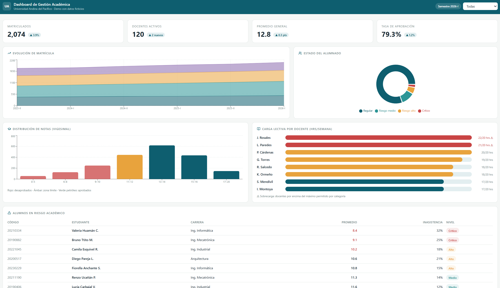

# 📊 Dashboard de Gestión Académica — Demo

> Demo de portafolio: dashboard interactivo para la gestión de datos académicos universitarios.
> **Todos los datos son ficticios** (institución, docentes y estudiantes inventados).

🇬🇧 [English version below](#-academic-management-dashboard--demo)



## ✨ Funcionalidades

- **Indicadores clave (KPIs)** — matriculados, docentes activos, promedio general y tasa de aprobación, recalculados en tiempo real según el filtro activo.
- **Filtro por carrera** — toda la vista (gráficos, KPIs y tablas) responde al filtro seleccionado.
- **Evolución de matrícula** — gráfico de área apilada con 6 semestres de historia.
- **Distribución de notas** — histograma en escala vigesimal con código de color (desaprobados / zona límite / aprobados).
- **Carga lectiva por docente** — barras de capacidad con detección automática de **sobrecarga horaria** según el máximo por categoría.
- **Alumnos en riesgo académico** — tabla con promedio, % de inasistencia y nivel de riesgo (Crítico / Alto / Medio).

## 🛠️ Stack

| Tecnología | Uso |
|---|---|
| React 18 | Componentes e interactividad |
| Recharts | Visualización de datos |
| Tailwind CSS 4 | Estilos |
| Vite | Build y desarrollo |
| Lucide | Iconografía |

## 🚀 Ejecutar localmente

```bash
git clone https://github.com/TU_USUARIO/dashboard-academico-demo.git
cd dashboard-academico-demo
npm install
npm run dev
```

Abrir `http://localhost:5173`.

## 🧩 Sobre este proyecto

Este demo refleja el tipo de soluciones que desarrollo profesionalmente para instituciones educativas y pymes: **dashboards que convierten datos dispersos (SQL Server, hojas de cálculo, sistemas académicos) en pantallas interactivas para tomar decisiones** — reportes de carga lectiva, seguimiento de estudiantes en riesgo, estadísticas de evaluación y más.

En proyectos reales trabajo además con **SQL Server** (diseño y optimización de consultas complejas sobre datos académicos), **Highstock/Chart.js**, integración con frameworks institucionales y temas adaptativos claro/oscuro.

## 📬 Contacto

**Fabio Jeri Alejos** — Ingeniero Mecatrónico · Lima, Perú
Desarrollo de dashboards y sistemas de datos · Disponible para proyectos freelance

- 💼 [LinkedIn](https://www.linkedin.com/in/fabio-jeri-alejos-0340b914a)
- 📧 fabiojeri2012@gmail.com

---

# 📊 Academic Management Dashboard — Demo

> Portfolio demo: interactive dashboard for university academic data management.
> **All data is fictional** (made-up institution, teachers and students).

## ✨ Features

- **Key indicators (KPIs)** — enrolled students, active teachers, overall average and pass rate, recalculated in real time based on the active filter.
- **Filter by program** — the entire view (charts, KPIs and tables) responds to the selected filter.
- **Enrollment trend** — stacked area chart with 6 semesters of history.
- **Grade distribution** — histogram (Peruvian 0–20 scale) with color coding (failing / borderline / passing).
- **Teaching load per teacher** — capacity bars with automatic **overload detection** based on category limits.
- **At-risk students** — table with GPA, absence rate and risk level (Critical / High / Medium).

## 🛠️ Stack

React 18 · Recharts · Tailwind CSS 4 · Vite · Lucide

## 🚀 Run locally

```bash
git clone https://github.com/YOUR_USERNAME/dashboard-academico-demo.git
cd dashboard-academico-demo
npm install
npm run dev
```

## 📬 Contact

**Fabio Jeri Alejos** — Mechatronics Engineer · Lima, Peru
Dashboard & data systems development · Available for freelance projects

- 💼 [LinkedIn](https://www.linkedin.com/in/fabio-jeri-alejos-0340b914a)
- 📧 fabiojeri2012@gmail.com

## 📄 Licencia / License

MIT
